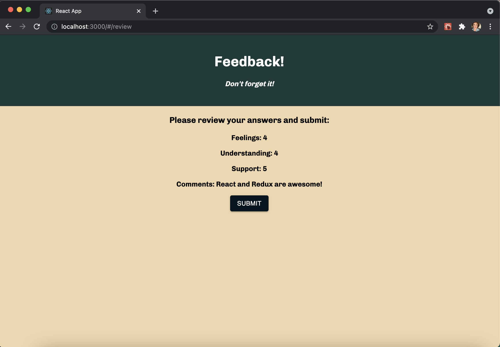

# Redux Feedback Loop

## Description

Duration: 2 day sprint

Created a full stackfeedback form in React to see how students at Prime Digital Academy are feeling about their experience. Feedback is collected over 4 views and then a fifth review page that displays their fedback and has a submit button that sends the feedback to the database. I created to following to-do list beforehand to track my progress and ensure all features were completed:

- [x] npm installs
- [x] created database in Postico
- [x] wrote boilerplate language in index. js: created store, reducers, etc (feelingsReducer, understandingReducer, supportReducer, commentsReducer)
- [x] created different routes using react router dom.
- [x] POST route and query text needed on server side
- [x] used a form for feeling, understanding, support, and comments feedback to capture user input and dispatch to store.
- [x] these forms need input validation to make sure user submits a ranking
- [x] used useSelector in review page and displayed previous feedback on DOM
- [x] sent feedback to database via axios POST on click of submit button
- [x] thank you page displays after submit button is clicked, inputs are cleared, and user is given the option to fill out feedback for a different day.

The deployed app can be found here: https://cryptic-spire-67868.herokuapp.com/#/

## Installation

1. Create a database named 'prime_feedback'
2. The queries in the 'database.sql' file are all set up for you. This project was built in Postgres, so you will need to have that installed and I'd recommed using Postico to run queries, as that is what I used to test my data.
3. Open your code editor and run an `npm install` in your terminal
4. Run `npm run client` and `npm run server`
5. Open on `localhost:3000`, server is on `localhost:5000`

## Screen Shots

## Built with:

  - React
  - Redux
  - Postgresql
  - Node.js
  - Axios
  - Express
  - PG
  - Material UI

## Acknowledgement

Thanks to my instructors Chris, Liz, Dane, and Kris and everyone at Prime Digital Academy for helping me learn the technical skills to build this!

## Support

If you have feedback or issues with the app, please reach out to me at sarah.helgen@gmail.com

